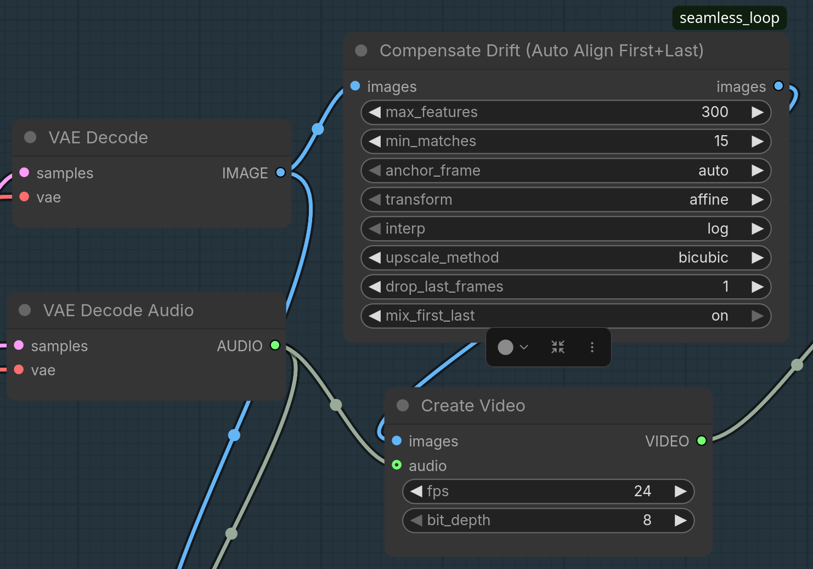

# Compensate Drift (Auto Align First+Last)

A ComfyUI custom node that registers every frame of an input batch against a
single **reference framing** derived from the first and last frames, so that the
whole sequence plays back with a fixed composition and can be looped seamlessly.

Where older drift-compensation nodes applied a blind programmatic zoom, this
node **measures** the drift by finding real correspondences between the first
and last frames and fitting a global geometric model to them. Nothing is
assumed about the drift: it can be a zoom, a pan, a rotation, or any affine
motion, in either direction.

---

## Table of contents

- [Installation](#installation)
- [Usage](#usage)
- [How it works](#how-it-works)
- [The registration maths](#the-registration-maths)
  - [1. Feature detection & matching](#1-feature-detection--matching)
  - [2. Transform estimation](#2-transform-estimation)
  - [3. Orientation disambiguation](#3-orientation-disambiguation)
  - [4. Choosing the anchor frame](#4-choosing-the-anchor-frame)
  - [5. Per-frame interpolation](#5-per-frame-interpolation)
  - [6. Warping](#6-warping)
  - [7. Seamless loop blending](#7-seamless-loop-blending)
- [Radial distortion](#radial-distortion)
- [Parameter reference](#parameter-reference)
- [Output](#output)
- [Edge cases & fallbacks](#edge-cases--fallbacks)
- [Testing](#testing)

---

## Installation

This is a [ComfyUI](https://github.com/comfyanonymous/ComfyUI) custom node, so
it installs as a folder under your ComfyUI `custom_nodes/` directory. It has
**no extra Python dependencies** — it uses `torch` and `opencv-python`, which
ComfyUI already provides.

Clone it straight into `custom_nodes/`:

```bash
cd <your-ComfyUI-dir>/custom_nodes
git clone https://github.com/amagicai/seamless_loop.git
```

(Or download the ZIP and extract it into `custom_nodes/seamless_loop/`.)

Then restart ComfyUI. The node appears in the node menu under
**image/batch** as **"Compensate Drift (Auto Align First+Last)"** (also
searchable as `seamless loop`, `autoalign`, `compensate drift`, etc.).

### Running the tests (optional)

From the repository root:

```bash
python -m pytest tests/test_align.py -q
```

See [Testing](#testing) for details and troubleshooting.

---

## Usage

The node is a simple **image batch in → image batch out** passthrough, so it
drops into any workflow that already produces and consumes an `images` stack
`(B, H, W, C)`. A typical placement is right after the decode and before the
video writer:



```
VAE Decode ──► Compensate Drift ──► Create Video
   (images)        (re-register)      (images)
```

Feed it your batch of frames and read the re-registered batch straight off the
`images` output — no other wiring required. Use `drop_last_frames` /
`mix_first_last` (see [Parameter reference](#parameter-reference)) for a
seamless loop wrap.

---

## How it works

Given a batch of `n` frames, the node:

1. Detects ORB keypoints/descriptors in the **first** and **last** frames and
   matches them, keeping only confident (ratio-tested) inlier matches after a
   RANSAC robust fit.
2. Fits a global 2D transform (affine or similarity) from the first frame to
   the last frame framing.
3. Picks one endpoint — the **anchor** — whose framing all `n` frames will be
   warped to share. By default (`auto`) it anchors to whichever endpoint is
   **more zoomed-in**, so every intermediate warp is a magnification.
4. Computes a per-frame warp by interpolating between the identity and the
   endpoint transform in the Lie-algebra (`log`) or coefficient (`linear`)
   domain.
5. Outputs the re-registered frames (by default dropping the redundant last
   frame, and optionally blending it into the first for a seamless loop wrap).

```
[first] ──ORB──┐                 ┌── anchor = first (auto) → A = I, B = G
[last]  ──ORB──┴──match──RANSAC──┤
                                  └── anchor = last  (auto) → A = G⁻¹, B = I
        frames i=0..n-1  ────────► Tᵢ = interp(A, B, fᵢ)  →  warp → reference framing
```

---

## The registration maths

### 1. Feature detection & matching

Both endpoint frames are converted to grayscale (`cv2.cvtColor(…,
COLOR_RGB2GRAY)`) and fed to an **ORB** detector with `max_features` keypoints:

```python
orb = cv2.ORB_create(nfeatures=max_features)
kp_first, des_first = orb.detectAndCompute(gray_first, None)
kp_last,  des_last  = orb.detectAndCompute(gray_last, None)
```

Descriptors are binary (Hamming) and are matched with a brute-force matcher
(`cv2.BFMatcher(cv2.NORM_HAMMING)`) using `k=2`. **Lowe's ratio test** keeps
only unambiguous matches — a match `{m, nn}` survives when

```python
m.distance < 0.7 * nn.distance
```

i.e. the closest descriptor is at least ~30% closer than the second-closest, a
proxy for distinctiveness. Surviving matches produce the correspondence sets

- `src_pts` — points in the **first** frame,
- `dst_pts` — the matching points in the **last** frame.

If either endpoint yields fewer than `min_matches` keypoints, or fewer than
`min_matches` surviving matches, the batch is returned unchanged (see
[Edge cases](#edge-cases--fallbacks)).

### 2. Transform estimation

The correspondences are robustly fit with RANSAC:

- `transform = "affine"` → `cv2.estimateAffine2D` fits a full 2D affine
  `𝐌 ∈ ℝ^{2×3}` with 6 dof (scale x, scale y, shear, rotation, tx, ty),
  reprojection threshold 3 px.
- `transform = "similarity"` → `cv2.estimateAffinePartial2D` fits a
  similarity `𝐌` with 4 dof (uniform scale, rotation, tx, ty) — it cannot
  represent anisotropic stretch.

The fit returns the inlier mask. `𝐌` maps **first → last** framings:

```
p_last = 𝐌 · p_first
```

The returned `M` is embedded into a homogeneous `3×3` matrix

```
M33 = [ M₍₂₍₃₎ ]   M33 = [M11 M12 M13]
      [ 0 0 1 ]           [M21 M22 M23]
                          [ 0   0   1 ]
```

If fewer than `min_matches` inliers survive RANSAC, the batch is returned
unchanged.

### 3. Orientation disambiguation

`estimateAffine2D` returns a consistent `src → dst` orientation, but a
degenerate or noisy fit can still come back numerically ambiguous. As a
defensive check, the node warps the **last** frame with each candidate (`M33`
and its inverse) and keeps the one that best reproduces the **first** frame
inside a shared central box:

```python
cen_y, cen_x, box = h // 2, w // 2, min(h, w) // 3
sl = lambda a: a[cen_y-box:cen_y+box, cen_x-box:cen_x+box]
```

The candidate with the smaller mean absolute difference in that region wins.
The result is `G`, the true map **last → first** framing

```
G ≈ M33     (if "forward" won)      G ≈ inv(M33)   (if "inverse" won)
detG = det(G₍₂₍₂₎)
```

`detG` summarizes the drift geometry: it is the area ratio of the last-frame
content when re-expressed in first-frame coordinates.

> Interpretation: `detG > 1` means the map `last → first` *magnifies* — the
> first frame shows larger content (a closer / more zoomed-in shot) than the
> last. `detG ≤ 1` means the last frame is the closer shot. So `detG` tells you
> which endpoint is more zoomed-in. The node logs `last->first framing det=...`
> so you can see which way the drift went.

### 4. Choosing the anchor frame

All frames must share one framing. The `anchor_frame` parameter decides which:

| `anchor_frame` | Decision |
|---|---|
| `"auto"`      | Anchor to the more zoomed-in endpoint: `detG > 1` → **first**, else **last**. |
| `"first"`     | Force the **first** frame's framing as reference. |
| `"last"`      | Force the **last** frame's framing as reference. |

The two endpoint warps `A` and `B` are set so the anchor is the identity:

```python
if anchor is FIRST:
    A = I          # first frame already at the reference framing
    B = G          # last frame warped down to the first framing
else:              # anchor is LAST
    A = inv(G)     # first frame warped up to the last framing
    B = I          # last frame already at the reference framing
```

**Why anchor to the most zoomed-in frame (`auto`)?** Because then every
interpolated warp is a *magnification*: it samples a region strictly inside the
source frame and simply crops away border detail. You discard information but
never **invent** it. Warping the other way requires re-synthesising border
pixels that do not exist in the source, which produces soft, hallucinated
edges. `first`/`last` override this, at the cost of zooming *out* through part
of the sequence.

### 5. Per-frame interpolation

Let `fᵢ = i/(n-1)`, `fᵢ ∈ [0,1]`. Frame `i` is warped with

- **`interp = "linear"`** — coefficient-space lerp of the homogeneous matrices:

  ```
  Tᵢ = (1 - fᵢ)·A + fᵢ·B
  ```

- **`interp = "log"`** (default) — interpolation on the Lie algebra, i.e. of
  the matrix logarithms, giving constant *velocity* motion:

  ```
  Tᵢ = exp((1 - fᵢ)·log(A) + fᵢ·log(B)),
  ```

  implemented in the **affine Lie algebra**: the 3×3 homogeneous endpoint
  matrices are mapped into `log`-space with `_affine_log`, blended, and mapped
  back with `_affine_exp`. Both use **Sylvester's closed form** on the 2×2
  linear part (`_log2x2`/`_exp2x2`), which handles real-distinct,
  complex-conjugate, and repeated eigenvalues *without* an eigendecomposition,
  so it stays well-conditioned for near-translation and near-pure-scale
  matrices. The affine log also couples translation to the linear part
  (`v = log(L)·(L−I)⁻¹·t`) so a zoom-about-centre stays a constant-velocity
  zoom, while a pure translation degenerates to `v = t`.

For a monotonic zoom, `log` interpolation ramps the **scale factor
exponentially**, so the visual zoom rate is constant across the sequence and
every frame looks like the previous one scaled by the same factor. `linear`
interpolation in matrix coefficients does *not* keep the zoom rate constant
(scaling decelerates as it approaches the target).

### 6. Warping

`cv2.warpAffine(img, T)` treats `T` as a *source→destination* coordinate map,
so internally it samples `src` at `T⁻¹·x_dst`. Interpolation is selected by
`upscale_method`; borders are replicated
(`BORDER_REPLICATE`) to avoid black seams at the image edges when the zoom *out*
case shifts the crop.

### 7. Seamless loop blending

After re-registration the sequence can be looped, but the wrap point
(`last output → first output`) may still show a sub-pixel jump from
interpolation aliasing. When BOTH of these hold —

- `drop_last_frames == 1` (the tail frame is dropped anyway), and
- `mix_first_last = "on"`

— the output first frame is replaced with the 50/50 average of the aligned
first frame and the **aligned (now-dropped) last frame**:

```python
out[0] = (aligned_first + aligned_last) / 2
```

Because both endpoints already share the same framing, this average hides the
residual interpolation noise at the loop seam at the cost of a slight
softening/ghosting in frame 0. It only applies for `drop_last_frames == 1` so
the semantics stay predictable.

---

## Radial distortion

Selecting `transform = "radial"` corrects **barrel** and **pincushion**
distortion and nothing else — it is mutually exclusive with the affine family
(`affine`/`similarity` correct pan/zoom/rotate/shear and nothing else). The two
cannot be combined, because a zoom and a radial distortion are confounded: a
global solver cannot tell whether the drift between two frames is a zoom or a
barrel. Pick whichever transform actually describes your footage.

The radial model uses a single coefficient on normalized coordinates (corner
radius = 1):

```
r' = r·(1 + k·r²)      # k > 0 = pincushion (edges pushed out), k < 0 = barrel
```

The node solves for `k` by **global image alignment** — it scans candidate
`k` values, removes each one from the last frame, and scores how well the
result reproduces the first frame in a shared central box (a per-keypoint
radius fit fails here because ORB only yields correspondences in the centre,
where the radial effect is sub-pixel). With the first frame as the radial
reference, every frame's coefficient interpolates `0 → k` across the batch and
each frame is radially corrected toward the first framing.

## Parameter reference

| Parameter | Type / values | Default | Description |
|---|---|---|---|
| `images` | `IMAGE` (B,H,W,C) | — | The batch of frames to re-register. |
| `max_features` | `INT`, 20–5000, step 10 | `300` | Maximum number of ORB keypoints **per endpoint frame**. More features = more robust RANSAC but slower. |
| `min_matches` | `INT`, 5–500, step 1 | `15` | Minimum number of ratio-test matches **and** RANSAC inliers required to proceed. Below this, the batch passes through unchanged. |
| `anchor_frame` | `auto` / `first` / `last` | `auto` | Which frame's framing all outputs share. `auto` anchors to the more zoomed-in endpoint (see [Choosing the anchor frame](#4-choosing-the-anchor-frame)). |
| `transform` | `affine` / `similarity` / `radial` | `affine` | Global model fit between endpoints. `affine` handles independent x/y scale & shear; `similarity` is rigid-ish (uniform scale + rotation + translation), more robust on noisy footage but cannot fix anisotropic stretch. `radial` corrects **only** radial (barrel/pincushion) distortion and is mutually exclusive with the affine family — it cannot pan/zoom/rotate (see [Radial distortion](#radial-distortion)). |
| `interp` | `log` / `linear` | `log` | How the per-frame transform is interpolated between the anchors (see [Per-frame interpolation](#5-per-frame-interpolation)). `log` keeps zoom velocity constant; `linear` interpolates matrix coefficients directly. |
| `upscale_method` | `nearest-exact` / `bilinear` / `area` / `bicubic` / `lanczos` | `bicubic` | Resampling filter used for all warps. `bicubic`/`lanczos` are sharper; `area` is best when downsampling. |
| `drop_last_frames` | `INT`, 0–1000, step 1 | `1` | How many trailing frames to trim from the output (also the loop-closure bookend). Clamped to `n−1`. |
| `mix_first_last` | `off` / `on` | `off` | When `on` **and** `drop_last_frames == 1`, replace output frame 0 with the 50/50 blend of aligned first + dropped last frame for a seamless loop wrap (§7). Ignored otherwise. |

---

## Output

A single `IMAGE` tensor of shape `(n − drop_last_frames, H, W, C)` on the same
device and dtype as the input. All retained frames share exactly one framing
(the chosen anchor).

Every run prints diagnostic logs to the console (prefixed `[seamless_loop]`):
frame count, size, matched/inlier counts, `det` of the last→first map, which
anchor was chosen (and why), and confirmation that the loop closed.

---

## Edge cases & fallbacks

- **1 frame, or 0 frames:** returned unchanged (trivially aligned).
- **Featureless / masked frames:** if fewer than `min_matches` keypoints or
  matches are found on either endpoint, the batch is returned without any
  re-registration — but `drop_last_frames` is still applied, so the output is
  `images[:out_n]` (the trailing frames are trimmed for loop closure).
- **RANSAC failure:** if the fit returns `None` or fewer than `min_matches`
  inliers, the batch passes through (again as `images[:out_n]`).
- **`drop_last_frames` ≥ `n`:** clamped to `n−1` so at least one frame always
  remains.
- **Different dtype/device:** inputs are moved through CPU `float32` for the
  OpenCV warps (and `uint8` only for ORB feature detection) and converted back
  to the original dtype/device on output. The image data is never quantised to
  8-bit, so `float64`/`float16` inputs keep their precision through the warp.

---

## Testing

The suite lives in `tests/test_align.py` and needs `pytest`, `numpy`,
`torch` and `opencv-python`. The node is **not installed as a package** — it is
a plain `__init__.py` inside the `seamless_loop/` directory. The test file
handles the import itself by inserting the *parent* of the package dir onto
`sys.path` (`tests/test_align.py`), so `from seamless_loop import …` resolves
no matter what the current working directory is.

Run it from the repository root (the folder containing `tests/`):

```bash
python -m pytest tests/test_align.py -q
```

> If you ever see `ModuleNotFoundError: No module named 'seamless_loop'`, the
> package parent is not on `PYTHONPATH`. Either run the command above from the
> repository root, or export the parent directory (the `custom_nodes/` folder
> containing `seamless_loop/`) instead:
>
> ```bash
> PYTHONPATH=.. python -m pytest tests/test_align.py -q
> ```

It verifies the loop closes for zoom-in, zoom-out, and anisotropic drift; that
forced `first`/`last` anchoring still registers; dtype/device/shape
preservation; single-frame and featureless pass-through; and the first/last
blend maths.
